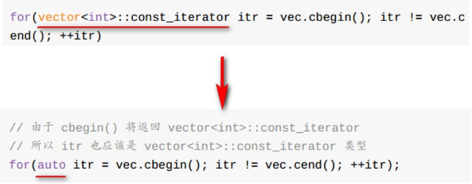

# HW03 C++新特性编程

教程：[从零开始一起学习SLAM | C  新特性要不要学？](https://mp.weixin.qq.com/s/iUFIPErq9NZ_LSGoyu555A) C++新特性视频课程已经上传了，在#视频课程 里可以看到，相关参考资料见#参考资料 

## 常见C++新特性

### 01 更方便的列表初始化

C++11前只有数组能使用初始化列表。而C++11后大部分类型都可以初始化列表，方便的很。如下所示。

```c++
double b = double{12.12};
int arr[3]{1,2,3};
vector<int> iv{1,2,3};
map<int,string>{{1,"a"},{2,"b"}};
string str{"Hello World"};
//new
int* a = neww int {3};
int* arr = new int[] {1,2,3};
```

### 02 省心省力的自动类型推导



不过，auto使用时也有需要注意的地方：

比如auto不能代表一个实际的类型声明，auto声明的变量必须马上初始化

### 03 简洁舒服的循环体

```c++
int arr[10] = {1,2,3,4,5,6,7,8,9,10};
for(int i = 0; i < 10; i++)
	cout << arr[i];
//new
int arr[10] = {1,2,3,4,5,6,7,8,9,10};
for(auto n:arr)
    std::cout << n;
```

此种循环支持大部分数据类型，比如数组、容器、字符串、迭代器等等；

### 04 简介的lambda表达式

**[函数对象参数](操作符重载函数参数）-> 返回值类型{函数体}**

```c++
//case 1 []中传入的b是全局变量
for_each(iv.begin(),iv.end(),[b](int &x){cout << (x+b) << endl;});
//case 2 []中传入=，表示可以取得所有的外部变量
for_each(iv.begin(),iv.end(),[=](int &x){x *= (a+b);});
//case 3 ->后加上的是Lambda表达式返回值的类型，下面返回了int类型变量
for_each(iv.begin(),iv.end(),[=](int &x)->int{return x*(a+b);});
```

### 05 随心所欲可变长的参数模板

```c++
//支持多种不同类型数据
auto tup1 = std::make_tuple("Hello World!",'a',3.14,0);
//方便拆分
auto tup1 = std::make_tuple(3.14,1,'a');
double a;
int b;
char c;
std::tie(a,b,c) = tup1; //结果是a= 3.14,b = 1,c = 'a'
//方便链接
std::tuple<float,string> tup1(3.14,'pi');
std::tuple<int,char> tup2(10,'a');
auto tup3 = tuple_cat(tup1,tup2);
```

### 06 其他新特性

decltype：像auto的反函数，可以从一个变量或表达式中得到类型；

nullptr：解决原来C++中NULL的二义性问题；

STL容器、智能指针、多线程相关的新特性

https://www.cnblogs.com/feng-sc/p/5710724.html

## CMakeLists.txt

```cmake
cmake_minimum_required(VERSION 2.8)
project(cppNewFeather)
SET(CMAKE_CXX_FLAGS "${CMAKE_CXX_FLAGS} -std=c++11 -O3")

find_package(OpenCV REQUIRED)

include_directories(${OpenCV_INCLUDE_DIRS})

add_executable(${PROJECT_NAME} cppNewFeather.cpp)
target_link_libraries(${PROJECT_NAME} ${OpenCV_LIBS})
```

## cppNewFeather.cpp

```c++
/****************************
* 题目：请使用C++新特性改下以下函数。该函数功能：将一组无序的坐标按照“Z”字形排序，并输出。
*
* 本程序学习目标：
* 熟悉C++新特性（循环、自动类型推导、列表初始化、lambda函数）
*
* 作者：公众号：计算机视觉life。发布于公众号旗下知识星球：从零开始学习SLAM
* 时间：2018.09
****************************/


#include "opencv2/opencv.hpp"

using namespace cv;
using namespace std;

bool cmp(Point2i pt1, Point2i pt2){
	if (pt1.x != pt2.x){
		return (pt1.x < pt2.x);
	}
	if (pt1.y != pt2.y){
		return (pt1.y < pt2.y);
	}
}
int main()
{
	vector<Point2i> vec{  Point2i(2, 1), Point2i(3, 3), Point2i(2, 3), Point2i(3, 2), Point2i(3, 1), Point2i(1, 3), Point2i(1, 1),Point2i(2, 2), Point2i(1, 2) };

	cout << "Before sort: " << endl;
	for (auto p : vec){
		cout << p << endl;
	}

	// 方法1
	sort(vec.begin(), vec.end(), [=](Point2i pt1, Point2i pt2)->bool{ if (pt1.x != pt2.x){ return (pt1.x < pt2.x); } if (pt1.y != pt2.y){ return (pt1.y < pt2.y); } });

	// 方法2
	//sort(vec.begin(), vec.end(), cmp);

	cout << "After sort: " << endl;
	for (auto p : vec){
		cout << p << endl;
	}

	return 0;
}
```

cmakelist.txt

```cmake
cmake_minimum_required(VERSION 3.13)
project(Assignment)

set(CMAKE_CXX_STANDARD 11)

find_package(OpenCV REQUIRED)
include_directories(${OpenCV_INCLUDE_DIRS})

add_executable(${PROJECT_NAME} main.cpp)
target_link_libraries(${PROJECT_NAME} ${OpenCV_LIBS})
```

main.cpp

```c++
#include <opencv2/opencv.hpp>

using namespace cv;
using namespace std;

int main() {
    vector<Point2i> vec = {{2, 1}, {3, 3}, {2, 3}, {3, 2}, {3, 1}, {1, 3}, {1, 1}, {2, 2}, {1, 2}};

    cout << "Before sort: " << endl;
    for (auto pt : vec)
    {
        cout << pt << endl;
    }

    sort(vec.begin(), vec.end(), [] (Point2i &pt1, Point2i &pt2) {
        return (pt1.x != pt2.x) ? (pt1.x < pt2.x) : (pt1.y < pt2.y);
    });

    cout << "After sort: " << endl;
    for (auto pt : vec)
    {
        cout << pt << endl;
    }
    return 0;
}
```

