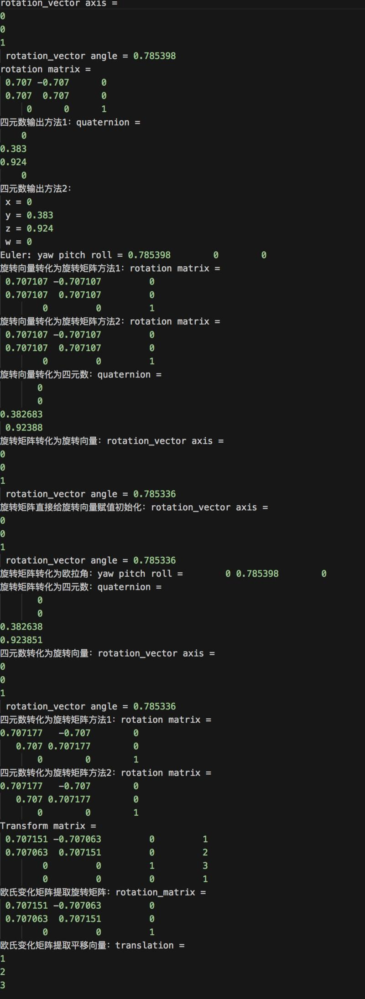

# HW05 三维空间旋转

[从零开始一起学习SLAM | 三维空间刚体的旋转](https://mp.weixin.qq.com/s/De-fkRVlqvYN6W9zYHS1_A)

已知旋转矩阵定义是沿着Z轴旋转45°。请按照该定义初始化旋转向量、旋转矩阵、四元数、欧拉角。请编程实现： 

1、以上四种表达方式的相互转换关系并输出，并参考给出的结果验证是否正确。

2、假设平移向量为（1,2,3）,请输出旋转矩阵和该平移矩阵构成的欧式变换矩阵，并根据欧式变换矩阵提取旋转向量及平移向量。 

本程序学习目标： 1、学习eigen中刚体旋转的四种表达方式，熟悉他们之间的相互转换关系 2、熟悉旋转平移和欧式变换矩阵的相互转换关系

## CMakeLists.txt

```cmake
cmake_minimum_required( VERSION 2.8 )
project( rotationTransforms )

# 添加Eigen头文件
include_directories( "/usr/include/eigen3" )
add_executable( rotationTransforms rotationTransforms.cpp )
```

## rotationTransforms.cpp

```c++
#include <iostream>
#include <cmath>
#include <eigen3/Eigen/Core>
#include <eigen3/Eigen/Dense>
#include <eigen3/Eigen/Geometry>
using namespace std;

int main ( int argc, char** argv )
{
    // ----------  初始化 -----------//

    // 旋转向量（轴角）：沿Z轴旋转45°
    Eigen::AngleAxisd rotation_vector ( M_PI/4, Eigen::Vector3d ( 0,0,1 ) );
    cout<<"rotation_vector axis = \n" << rotation_vector.axis() <<"\n rotation_vector angle = "<< rotation_vector.angle()<<endl;

    //旋转矩阵：沿Z轴旋转45°
    Eigen::Matrix3d rotation_matrix = Eigen::Matrix3d::Identity();
    rotation_matrix <<  0.707, -0.707,      0,
            0.707,  0.707,      0,
            0,      0,          1;
    cout<<"rotation matrix =\n"<<rotation_matrix <<endl;

    // 四元数：沿Z轴旋转45°
    Eigen::Quaterniond quat = Eigen::Quaterniond(0, 0, 0.383, 0.924);
    cout<<"四元数输出方法1：quaternion = \n"<<quat.coeffs() <<endl;   // 请注意coeffs的顺序是(x,y,z,w),w为实部，前三者为虚部
    cout<<"四元数输出方法2：\n x = " << quat.x() << "\n y = " << quat.y() << "\n z = " << quat.z() << "\n w = " << quat.w() << endl;

    // 欧拉角: ：沿Z轴旋转45°
    Eigen::Vector3d euler_angles = Eigen::Vector3d(M_PI/4, 0, 0);// ZYX顺序，即roll pitch yaw顺序
    cout<<"Euler: yaw pitch roll = "<<euler_angles.transpose()<<endl;


    //  相互转化关系 
    // ----------  请在下面补充对应的代码 ----------
    // 旋转向量转化为其他形式
    cout<<"旋转向量转化为旋转矩阵方法1：rotation matrix =\n"<< rotation_vector.toRotationMatrix() <<endl;
    cout<<"旋转向量转化为旋转矩阵方法2：rotation matrix =\n"<< rotation_vector.matrix()<<endl;

    quat = rotation_vector;
    cout<<"旋转向量转化为四元数：quaternion =\n"<< quat.coeffs() <<endl;  //coeffs的顺序是(x,y,z,w),w为实部，前三者为虚部


    // 旋转矩阵转化为其他形式

    cout<<"旋转矩阵转化为旋转向量：rotation_vector axis = \n" << rotation_vector.fromRotationMatrix(rotation_matrix).axis()
        <<"\n rotation_vector angle = "<< rotation_vector.fromRotationMatrix(rotation_matrix).angle() <<endl;
    //注意：fromRotationMatrix 参数只适用于旋转向量，不适用于四元数

    rotation_vector = rotation_matrix;
    cout<<"旋转矩阵直接给旋转向量赋值初始化：rotation_vector axis = \n" << rotation_vector.axis()
        <<"\n rotation_vector angle = "<< rotation_vector.angle() <<endl;
    
    euler_angles = rotation_matrix.eulerAngles(M_PI/4, 0, 0);                           // 这里是难点容易出错！！！
    cout<<"旋转矩阵转化为欧拉角：yaw pitch roll = "<< euler_angles.transpose() <<endl;

    quat = rotation_matrix;
    cout<<"旋转矩阵转化为四元数：quaternion =\n"<< quat.coeffs() <<endl;
    // 四元数转化为其他形式
    rotation_vector = quat;
    cout<<"四元数转化为旋转向量：rotation_vector axis = \n" << rotation_vector.axis()
        <<"\n rotation_vector angle = "<< rotation_vector.angle() <<endl;

    rotation_matrix = quat.toRotationMatrix();
    cout<<"四元数转化为旋转矩阵方法1：rotation matrix =\n"<< rotation_matrix <<endl;

    rotation_matrix = quat.matrix();
    cout<<"四元数转化为旋转矩阵方法2：rotation matrix =\n"<< rotation_matrix <<endl;


    //  欧氏变换矩阵

     // 欧氏变换矩阵使用 Eigen::Isometry，仿射变换用 Eigen::Affine3d，射影变换用 Eigen::Projective3d
     Eigen::Isometry3d T = Eigen::Isometry3d::Identity();              // 名称为3d，实质上是4 x 4的矩阵 Identity()初始化为单位矩阵
     T.rotate( rotation_vector );                                      // 添加旋转矩阵 R
     Eigen::Vector3d v1 = Eigen::Vector3d (1, 2, 3);
     T.pretranslate( v1 );                                             // 添加平移向量 t

     cout << "Transform matrix = \n" << T.matrix() <<endl;             // 变换矩阵需要用成员函数转一下输出

     // 变换矩阵 = 旋转矩阵 + 平移向量
     cout << "欧氏变化矩阵提取旋转矩阵 R ：rotation_matrix = \n" << T.rotation()<< endl;
     cout << "欧氏变化矩阵提取平移向量 t ：translation = \n" << T.translation() << endl;

    // ----------  结束 ----------
    return 0;
}
```

