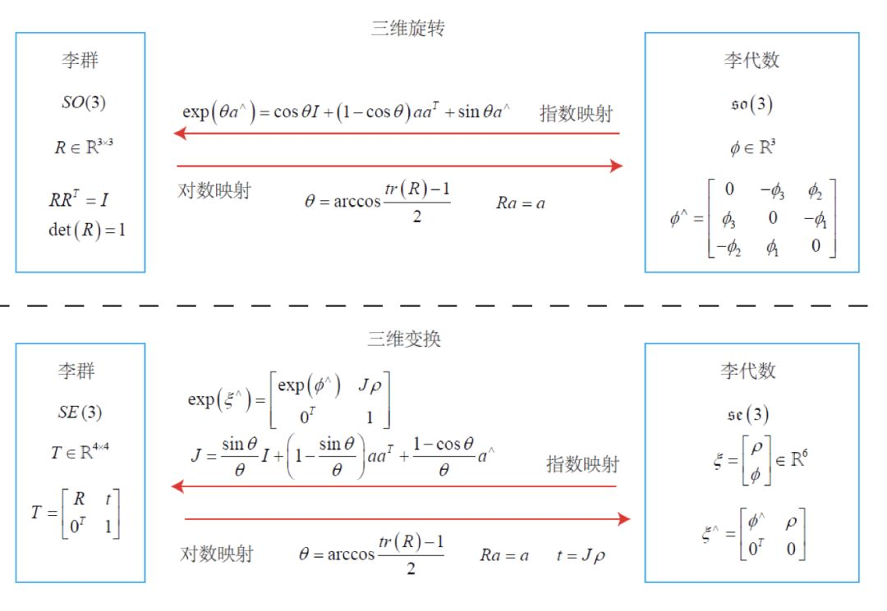

# HW06 理论推导

 [作业7：理论推导题.pdf](作业7：理论推导题.pdf) 

[从零开始一起学习SLAM | 为啥需要李群与李代数？](https://mp.weixin.qq.com/s?__biz=MzIxOTczOTM4NA==&mid=2247486047&idx=1&sn=25d97bb47c26ac3babafd668ee0c013b&chksm=97d7efc8a0a066de0990dc79de32c666aff4698aa1f8dbfc131cc426e6beba96cd5260d0a667&token=1735725181&lang=zh_CN#rd)

